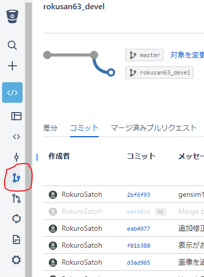

# Gitの使い方 #

## gitって何? ##

gitは分散型のバージョン管理ツールです

## gitのインストール ##
---

### Linuxの場合 ###

これで入ります

    sudo apt install git

初期設定としてユーザー名とメールアドレスを登録してください

    git config --global user.name  <名前(bitbucketの表示名とかがいい)>
    git config --global user.email <bitbucketで登録したメールアドレス>

---
### Windowsの場合 ###

Windowsではインストーラからパッケージをインストールしてくる必要があります。

[Git for Windows](https://git-for-windows.github.io/)

1. Select Componentsはそのまま勧めて貰えれば大丈夫だと思います。
1. Use Git with Windows Command Promptを選択(Pathが自動設定されます)
1. Chechout as-is, commit as-isを選択
1. Use MinTTY / default command prompt はどっちでもいいです

インストールが完了したら初期設定としてユーザー名とメールアドレスを登録してください

    git config --global user.name  (名前　bitbucketの表示名とかがいい)
    git config --global user.email (bitbucketで登録したメールアドレス)

---
## 最初にやること ##
---

新しいリポジトリで作業を開始するときには以下のことをやってください。

### リポジトリのクローン ###
まず、BitBucketからローカルにリポジトリをコピーしてくる必要があります（クローン）

ターミナル(windowsならコマンドプロンプト or PowerShell)を開いてリポジトリ（ソースを置くディレクトリ）を置きたい場所に移動

    C:¥...¥>cd Repositories
    C:¥...¥Repositories>

リポジトリをBitbucketからクローンしてくる

    C:¥...¥Repositories>git clone https://<ユーザー名>@bitbucket.org/tmukeisankinlpzemi2017/jawordtovec.git

指定するURLはBitBucketのリポジトリページの概要のページ上方にある`HTTPS`(`Git`の表示になってる場合もある)ボタンの隣のURLからコピーペーストしてくるのがおすすめです。

`C:¥...¥Repositories`に`jawordtovec`というフォルダが作成されます。

### クローンが終わったら（動作確認） ###

動作確認のためリポジトリのディレクトリに移動して以下の作業を行ってみてください

自分用の作業ブランチを作る

    C:¥...¥Repositories¥jawordtovec>git checkout -b <ユーザー名>_devel

とりあえず自分の作業用ブランチとして`<ユーザー名>_devel`という名前のブランチを作ります。ユーザー名は他の人と違えばいいので適当で大丈夫です。

なんかファイルをつくる

    C:¥...¥Repositories¥jawordtovec>copy nul <ユーザー名>_testes.txt

コミット

    C:¥...¥Repositories¥jawordtovec>git add ./
    C:¥...¥Repositories¥jawordtovec>git commit -m "test commit"

リモートにブランチをプッシュ

パスワードを聞かれる場合がありますがbitbucketのパスワードを入力してください。

    C:¥...¥Repositories¥jawordtovec>git push -u origin <ユーザー名>_devel
    Password for <User>:(bitbucketで登録したパスワードを入力)

新しいブランチがBitbucketに作成されているはずです。

最初に指定する-uオプションでupstreamブランチが設定され、以降の`git pull`、`git push`ではリポジトリ(origin <ユーザー名>_devel)を省略できます

---
## gitを使う流れ ##
---

初期設定、リポジトリのクローンが終わったら基本的には以下のことを反復的に行うことで開発を進めます。

コマンドラインで作業する前提になってますがVS Codeがインストールされている場合はVS Codeのgitボタンから作業するほうが楽だと思います。[こっち](gitの使い方VSCode版.md)を参照

### 大雑把な流れ ###

1. リモートリポジトリ(Bitbucket)に蓄えられた変更をローカルに適用する(`git pull`)
2. テキストエディタとかで中身をいろいろと変更する。
3. 加えた変更をコミットする。(`git commit`)。
4. ２〜３を繰り返す。
5. コミットした変更たちをリモートに適用する。(`git push`)

### リモートの変更をローカルに適用(プル) ###

ローカルで作業するときはリモートリポジトリの変更を適用してから作業を開始してください、やり忘れると結構面倒なことになります。

    C:¥...¥Repositories¥jawordtovec>git pull

### 変更のコミット ###

`git add`で変更したファイルを指定(ステージング)します。`./`を指定することで変更した全ファイルが指定されます。

`git commit`でコミットするときには必ず変更の説明(コミットメッセージ)が必要になります。めんどくさいですがなんか描いてください（変更の説明を書いたほうが親切）

    C:¥...¥Repositories¥jawordtovec>git add ./
    C:¥...¥Repositories¥jawordtovec>git commit -m "<コミットメッセージ>"

ちなみにコミットメッセージ(-mオプション)を省略しようとするとvimが起動してコミットメッセージを入力するように促されます。そうなった場合は

`i`キーを押す→適当なメッセージを入力→`<Esc>`キー→`:w<Enter>`→`:q<Enter>`

で終了します。

### ローカルの変更をリモートに適用 ###

変更がある程度完了したり作業を終わらせるときは、git pushでリモートに変更を適用してください。

    C:¥...¥Repositories¥jawordtovec>git push

やり忘れると結構面倒なことになります。家での作業をpushし忘れて研究室に来たりすると悲惨です。

## その他 ##

一応必要そうなコマンドは以上です。

他にもブランチの細かい話とかマージとかあるんですけどそれは後ほどやれたらと思っています.

### 作業内容の表示 ###

`git status`で現在の作業ブランチの情報を取得できます。
    
    C:¥...¥jawordtovec> git status
    On branch rokusan63_devel
    このブランチは 'origin/rokusan63_devel' よりも2コミット進んでいます。
    (use "git push" to publish your local commits)
    Untracked files:
    (use "git add <file>..." to include in what will be committed)

            "doc/git\343\201\256\344\275\277\343\201\204\346\226\271VSCode\347\211\210.md"

    nothing added to commit but untracked files present (use "git add" to track)

このコマンドでわかる情報は

    * 作業ブランチ名
    * リモート(upstream)に対して遅れて(進んで)いるコミット数
    * 前回のコミット以降で変更されたファイル
    * 前回のコミット以降で変更されたけど`git add`でステージングされてないファイル

### ブランチのの切り替え ###

`git checkout`で作業ブランチを切り替えできます。

    git checkout <ブランチ名>

## マージ　##

リポジトリのバージョンは何もしなければブランチごとに独立に進んでいきます。

このリポジトリでは自分の作業が終わった時点でmasterブランチにマージを行うことで各人の作業内容を共有していきたいと考えています。

### masterから開発ブランチ(<user>_devel)へのマージ ###

自分以外の誰かによって`master`ブランチが変更された場合にはその変更を自分の`devel`ブランチに変更を適用します。この作業はなるべくローカル側で適用を行ってください。

まず、`master`ブランチを最新の状態に更新します.

    git checkout master
    git pull

次に、作業ブランチを`<user>_devel`に変更して`git merge`コマンドを実行してください。

    git checkout <user>_devel
    git merge master

これでマージが完了します。ここで各々のブランチで変更した対象が重複していると、変更の* 衝突(Conflict) *が起こることがあります。衝突した場合はエディタなどで衝突を手動で解消する必要があります。

(VSCodeで行うのが比較的便利です[VSCode版参照](gitの使い方VSCode版.md))

衝突箇所はそれぞれのブランチにおける変更が並べて記録されています。

    <<<<<<< HEAD
    develでの変更
    =======
    masterでの変更
    >>>>>>> master

これをエディタ等を使って消したいものを消して、残したいものを残してください。

    develでの変更

手動で衝突を解消したら。通常通りコミットを行ってください。

    git add conflicted_file.txt
    git commit -m "衝突解消"

### 開発ブランチからmasterにマージ ###

develからmasterへのマージは、pull requestを作成するためにローカルではなくリモートリポジトリからブラウザを使ってマージを行うことにします。

**まず、devel->masterマージを行う前にあらかじめmasterブランチの変更をdevelにマージしておいてください(前の項目を参照)**(ブラウザ側で衝突が起こると解消が若干面倒なため)

リモートリポジトリを最新の状態にしておきます。

    git checkout <user>_devel
    git pull
    git push

BitBucketのリモートリポジトリをブラウザで開きます。

ページ左のボタンからブランチにビューを切り替えて、自分の開発ブランチを選択してください。

ビュー左上にあるマージボタンを押すと以下のようなボックスが出てきます。

マージを押すとマージが完了します。
マージオプションはマージコミット、squashのどちらでも構いません。squashの場合、コミットが一つにまとめられます。

