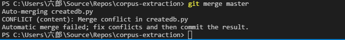

# Visual Studio CodeからGitを利用する #

Visual Studio CodeにはGitが標準で付いているのでコマンドラインでいちいちコマンドを打つより、VSCodeで作業したほうが効率的なことが多いです。

## 大雑把な流れ ##

クローンまではできてる前提で話を進めます。
### 大雑把な流れ(再掲) ###

1. リモートリポジトリ(Bitbucket)に蓄えられた変更をローカルに適用する(`git pull`)
2. テキストエディタとかで中身をいろいろと変更する。
3. 加えた変更をコミットする。(`git commit`)。
4. ２〜３を繰り返す。
5. コミットした変更たちをリモートに適用する。(`git push`)

### ローカルリポジトリを開く ###

Gitを使用した作業を行うにはローカルリポジトリのフォルダを開いておく必要があります。

### プル ###

左下の回ってる矢印（Sync）を押します。

### コミット ###

左のサイドバーをgitに切り替えます。

コミットメッセージを入力してCtrl+Enterを押すとコミットされます。

ステージングするファイルを指定することもできますが、何も指定しないでコミットした場合、自動的に全ファイルがステージングされます。

### プッシュ ###

プルと同様に左下の回ってる矢印（Sync）を押します。

### ブランチの切り替え(CheckOut) ###

左下のブランチ名が書かれているボタンを押します。

上にブランチ名の一覧が現れるので切り替えたいブランチを押してください。

### マージ ###

VisualStudioCodeにはマージをする特殊な機能等はありません。

統合ターミナルでマージコマンドを打ってください。

手順的には以下のような感じです

---
`master->devel`の時は

1. 左下のブランチ名をクリックして`master`にブランチ切り替え
1. Syncボタンでoriginと同期
1. 左下のブランチ名をクリックして`devel`にブランチ切り替え
1. 統合ターミナルを開いて(`Ctrl+Shift+@`)`git merge master`を実行
1. Syncボタンでoriginと同期

`devel->master`の時は

1. `master->devel`のマージをあらかじめやっておく
1. Syncボタンで同期
1. ブラウザからマージ

### 衝突の解決 ###

mergeで衝突が発生した場合、衝突した項目は左のgitサイドバー上で`(C)`と表示されます。

ファイルをクリックすると衝突部分にジャンプするので修正を行ってください。

修正前

修正後

`Alt+M`を押してから↑あるいは↓カーソルキーを押すと同一ファイル内の直前、直後の衝突にジャンプします。

修正が終わったらコミットして、衝突の解消が完了します。

