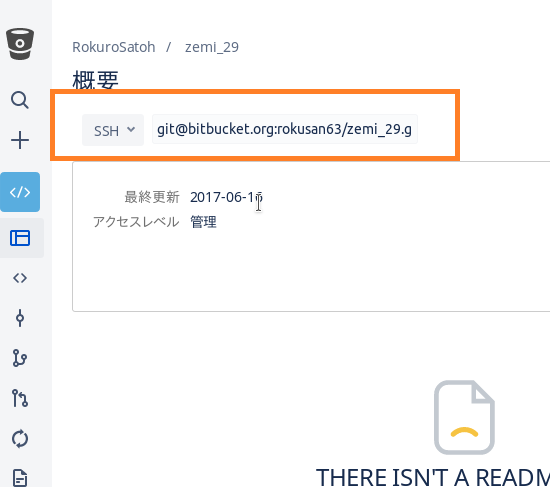

# gitにssh鍵を設定する #

linux上でgitにssh鍵を設定する手順を示します。（ちなみにSourceTreeなどのGuiクライアントを使っている場合、guiから設定できる場合があります。）

Windowsでもopensshをインストール(ちょっと面倒)して`~/.ssh`->`C:\\Users\\Username\\.ssh`に置き換えれば動作すると思います。

## ssh鍵の何がいいの? ##

**`pull`や`push`などでサーバーとやり取りする際にパスワードの入力を省略できる**

## 超大雑把な手順 ##

サービス（Bitbucket/Github...）によらず大体の流れはこんな感じです。

1. 鍵の生成
    * `~/.ssh`上でssh-keygenを実行して公開鍵、秘密鍵のペアを生成する    
1. 公開鍵の登録
    * リモートリポジトリを提供しているサービスページのアカウント設定画面から生成した公開鍵を登録する.
1. sshの設定
    * `~/.ssh`上の`config`をいじってサービスのサイトと鍵を結びつける。
    * `ssh -T`を使ってテスト(省略可)
1. リモートURLの(再)設定
    * ssh用のURLでクローンするかローカルリポジトリ既存のリモートURLを書き換える
1. 完了
    * 好きなだけ`pull`と`push`をする

## 必要なもの ##

* openssh - おそらくデフォルトで入っていると思われます。

## 具体的な流れ ##
---

具体的にローカル:linux, リモート:bitbucketで登録する場合について説明していきます。
(他のサービスでもローカルの設定はほぼ変わりません,URLに気をつければ普通に設定できるはずです)

### 鍵の生成 ###
---

`~/.ssh`(`home/ユーザー名/.ssh`のこと,)上に２つの鍵ファイル(公開鍵、秘密鍵)を作ります.

まず`~/.ssh`に移動します

    mkdir ~/.ssh # .sshが存在しない場合は実行してください
    cd ~/.ssh

以下のコマンドを実行してください

    ssh-keygen -t rsa -f id_rsa_bitbucket -C <BitBucketで登録したメールアドレス>

パススレーズの入力を求められますが空で設定して構いません(空にしなかった場合、pull,pusｈのたびに入力を求められます)
-f オプションの文字列は任意で構いません、作られる鍵の名前になります。

    user1@computer1:~/.ssh$ ssh-keygen -t rsa -f id_rsa_bitbucket -C address@mail.com
    Generating public/private rsa key pair.
    Enter passphrase (empty for no passphrase):[空]
    Enter same passphrase again:[空]

成功すると以下のような画面が出てきます

    Your identification has been saved in id_rsa_bitbucket.
    Your public key has been saved in id_rsa_bitbucket.pub.
    The key fingerprint is:
    SHA256:Gl2peyqnImtBVBIbx1VbaiS4qQcO4gW4xw/3Inrscjg address@mail.com
    The key's randomart image is:
    +---[RSA 2048]----+
    |  +oo. .o..      |
    |  .* ..  + .     |
    | .o o . = o      |
    |...  . + +       |
    |+o    . S        |
    |=oo    o .       |
    |+=+o. . . .      |
    |E.O+o.. .o       |
    |.Xo+.oo+.        |
    +----[SHA256]-----+

生成が終わると秘密鍵:`id_rsa_bitbucket`と,公開鍵:`id_rsa_bitbucket.pub`が生成されます。

### 公開鍵の登録 ###
---

### 公開鍵をクリップボードにコピー ###

まず、公開鍵(pubの方)をクリップボードにコピーします。
エディタとマウスを使ってコピーするのでも構いませんがコマンド一発のほうが楽だと思います

まず、aptからxselをインストールします。

    sudo apt install xsel

以下のコマンドを実行してください

    cat id_rsa_bitibucket.pub | xsel --clipboard --input

### 公開鍵をサーバーに登録(Bitbucketの場合) ###

bitbucketを開いたら右下のサムネイルをクリック(1)して、`BitBucket Settings`を選択してください(2)

`セキュリティ > SSH 鍵`を選択します(3)

`鍵を追加`を選択します(5) <-番号が飛んでいましたすみません

ラベルは適当に設定,下のエディットボックスにコピーした公開鍵を貼り付けて(６)`鍵を追加`を押します（７）。

### sshの設定 ###
---

鍵の追加が終わったらsshの`config`ファイルを編集します.

`~/.ssh/config`がない場合、`touch ~/.ssh/config`でconfigファイルを作成してください.

エディタで`config`ファイルを編集します.コマンドラインから編集する場合は以下のコマンドを実行

    kate config

以下の内容を追加してください

    Host bitbucket bitbucket.org
      HostName bitbucket.org
      User git
      IdentityFile ~/.ssh/id_rsa_bitbucket

### 接続確認（飛ばして構いません） ###

編集がおわったら動作確認のため、以下のコマンドを実行します。

    ssh -T git@bitbucket.org

(初回接続の際は接続するか確認を取られます。yesと入力すると次に進みます)

### リモートURLの(再)設定 ###
---

### gitからsshを使うためのURLの取得 ###

sshを利用する場合、デフォルトのhttps利用の場合とリモートリポジトリのアドレスが異なります。アドレスのフォーマットはサービスによって異なるので新しいサービスを使う場合は確認しておいてください。

既存のbitbucketリポジトリのアドレスはブラウザから取得するのが手っ取り早いです。リポジトリの概要画面からURLをコピーできます。

ちなみにbitbucketのリモートURLは個人リポジトリ場合

    HTTPS: https://bitbucket.org/username/repository.git
    SSH: git@bitbucket.org:username/repository.git

チームリポジトリの場合は

    HTTPS: https://username@bitbucket.org/teamname/repository.git
    SSH: git@bitbucket.org:teamname/repository.git

になります。

ssh用のURLをコピーしたら。`git clone`で新たにリポジトリを作りなおすか、既存のリポジトリのurlを書き換えます。

### gitのリモートリポジトリアドレスの変更 ###

`git remote`を使ってリモートリポジトリの設定を確認、変更できます。
リモートからクローンしてきたリポジトリの場合、クローン元のリポジトリは`origin`という名前で登録されています。

以下のコマンドでリモートのurlを書き換えられます。<URL>を先ほどコピーしたURLで置き換えてください。

    git remote set-url origin <URL>

ちなみに以下のコマンドでリモートリポジトリとアドレスの一覧を確認できます

    git remote -v

### 完了 ###
---

### git push or git pullを一回試してみる ###

sshでの初回動作時には`unknown host`的な英文が出て、何か聞かれますが、
`yes`と入力してEnterを押してください。(厳密にはセキュリティ上の手続きでfingerprintが一致してるかここで確認します。)

エラーが発生してなければ成功です。

